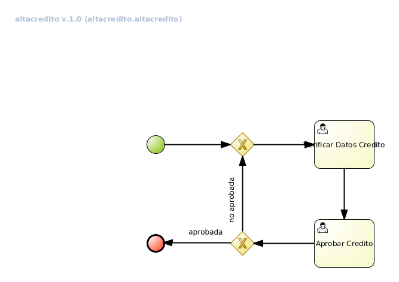

#bpms-poc-solicitudcredito

POC usando BPMS JBPM6 

## Proceso de Aprobación de Credito Dummy
Imagen en poc/src/main/resources/altacredito.altacredito-image.png

Archivo BPMN2 poc/src/main/resources/altacredito.bpmn2
[Proceso bpmn2](poc/src/main/resources/altacredito.bpmn2 "Proceso bpmn2")

Posee dos Tareas Humanas:
Verificar Solicitud Credito -> Grupo: recepcion, admim
Aprobar Solicitud Credito -> Grupo: analista, admin

2) Clases
com.cuyum.BpmService: Facade de acceso a las KIE de jBPM
com.cuyum.MainClass: Clase principal que se conecta al server de jBPM, crea una instancia 
y ejecuta las tareas humanas a traves de BpmService.

3) Propiedades de conexión
Dentro de com.cuyum.MainClass estan las propiedades para conectarse al servidor jBPM

url = "http://[SERVER]:[PORT]/business-central/"; url del servidor de jbpm
deploymentId = "pe.com.bcp:altacredito:1.0"; identificación de la unidad de deploy
processDefinitionId = "altacredito.altacredito"; identifiación del proceso de alta de credito
user = "user"; //usuario con roles: "recepcion", "analista" pass="a123456$";
password = "pass"

4) Se puede usar contra el server 162.243.12.101:8080 que quedara disponible algunos dias
Esta instancia tiene los siguientes usuarios:
juan: recepcion
jose: analista
admibcrea: recepcion, analista

5) Se puede instalar un server propio de BPM Suite 6 y agregar los usuarios y roles rqueridos.
Luego se debe importar el procesos bpmn2 y crera la unidad de deply que será utilizada por
este POC

Contacto: German Leotta <gleotta@servicios-redhat.com>

